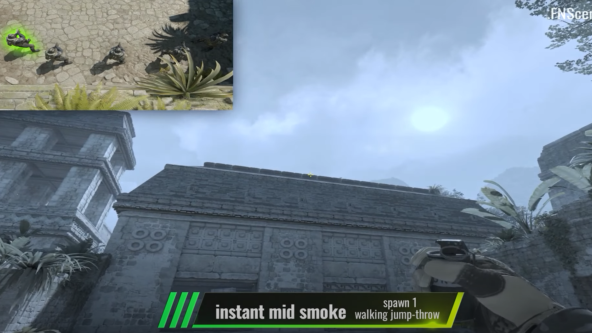
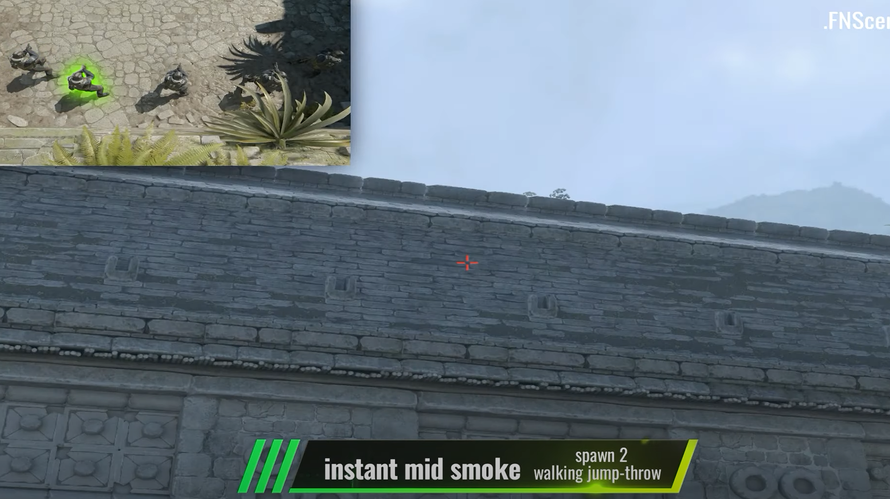
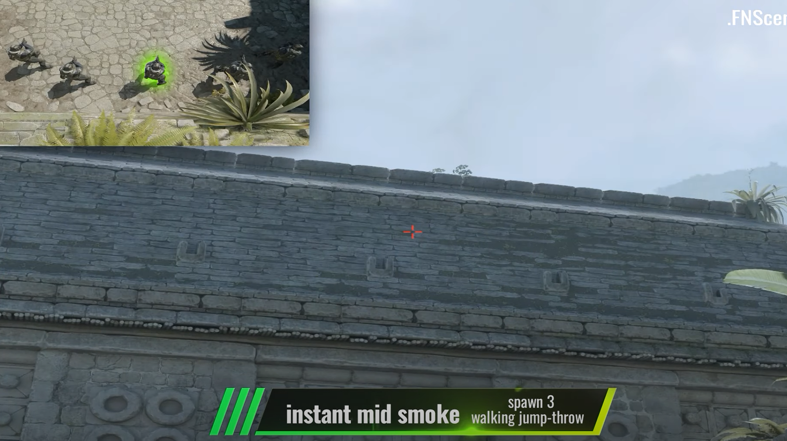
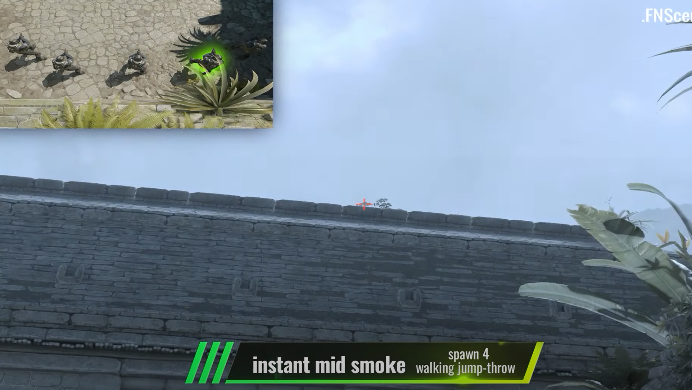
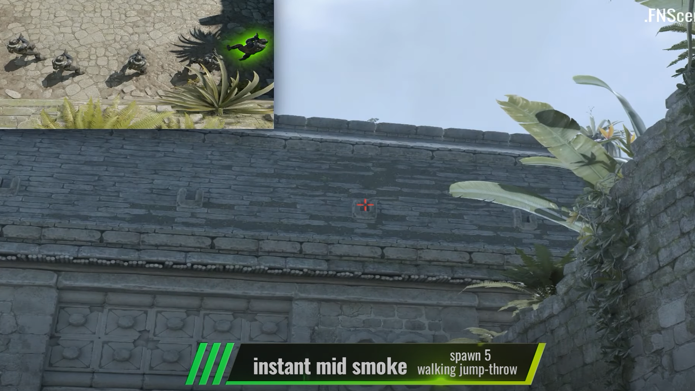
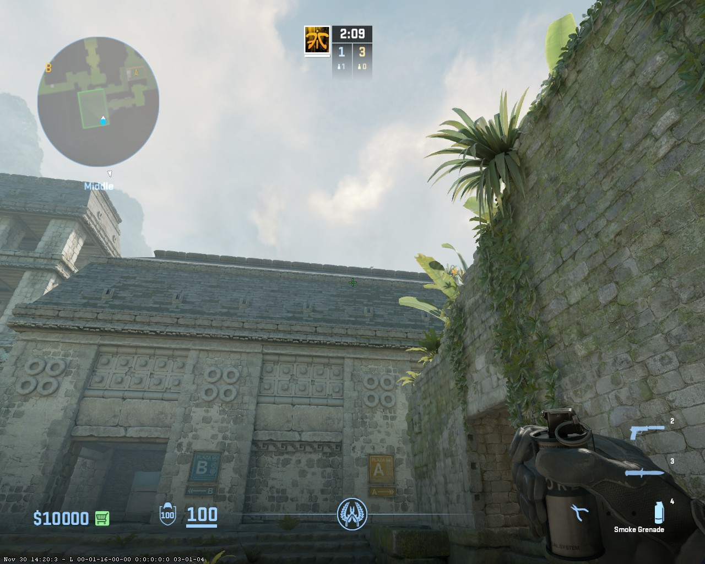
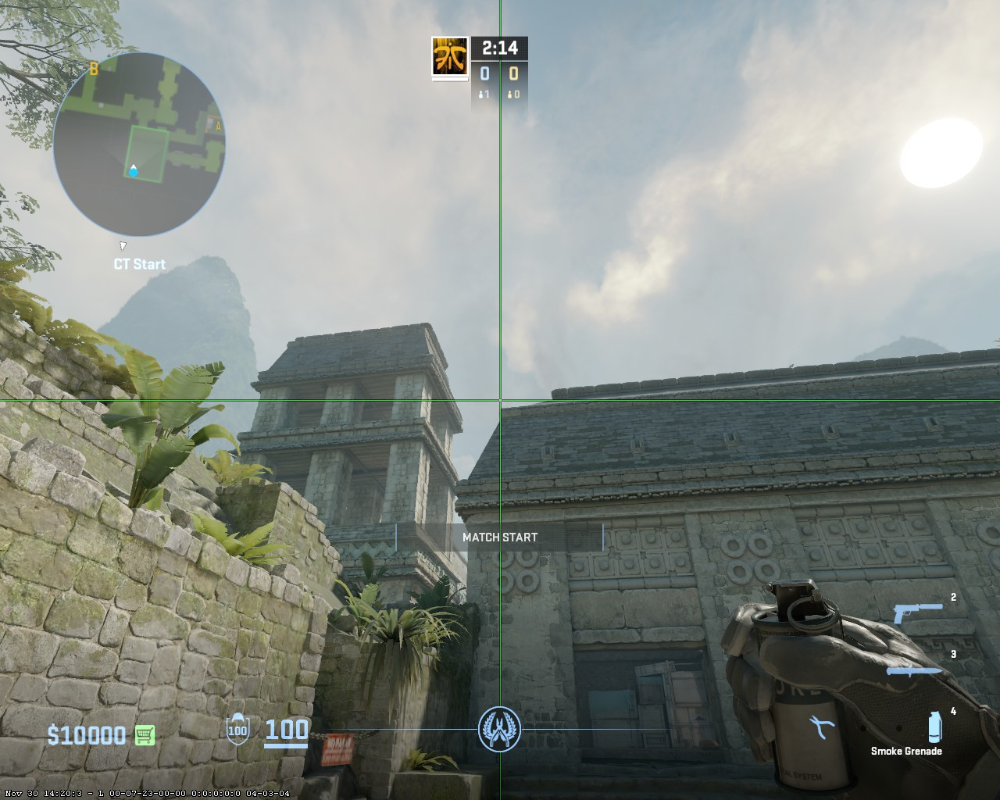

< [Main](./README.md)
< [Ancient](../../README.md)

# Insta mid from CT base

## 2 shift steps + Jump Throw

### 1 spot

### 2 spot

### 3 spot

### 4 spot

### 5 spot

## Insta cave from 1 spot CT base

