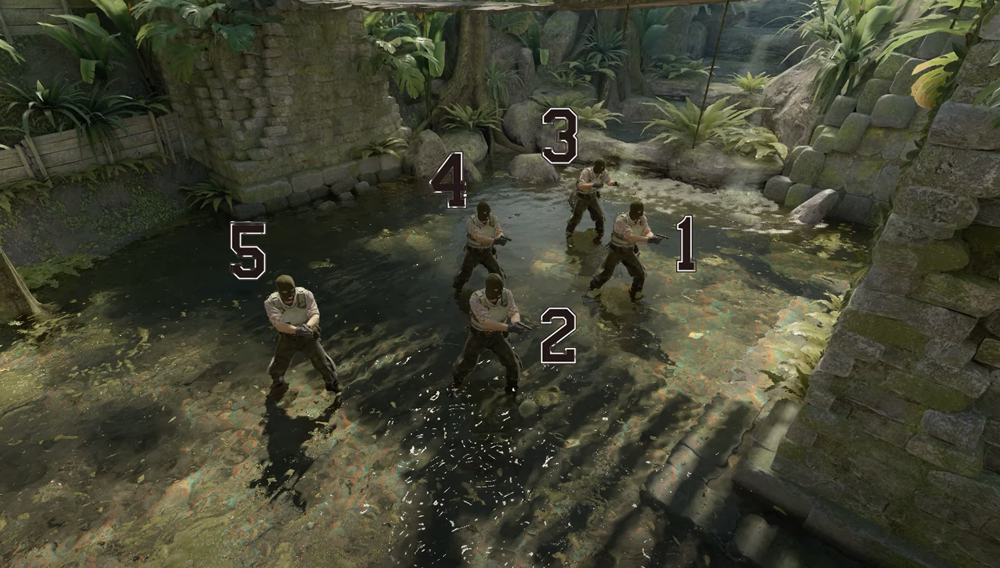
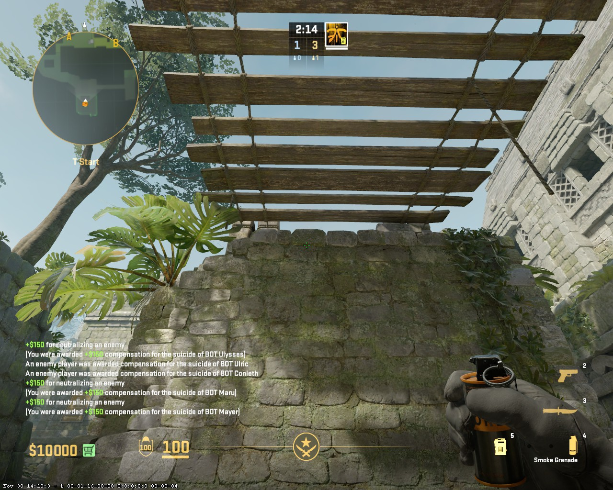
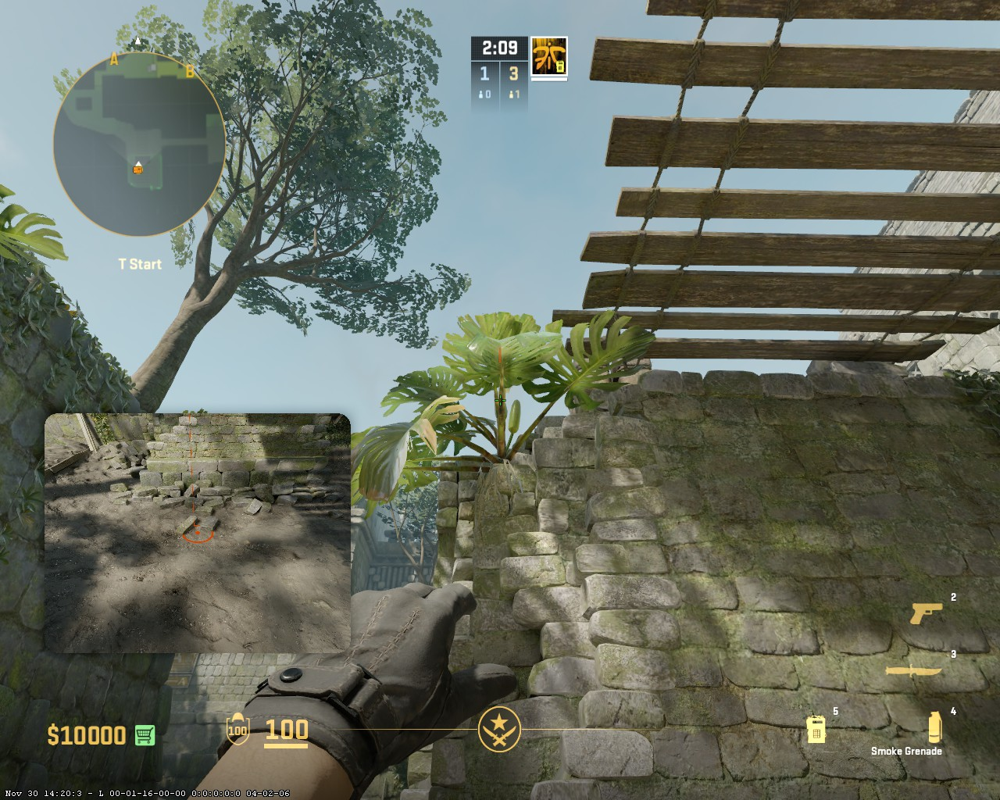
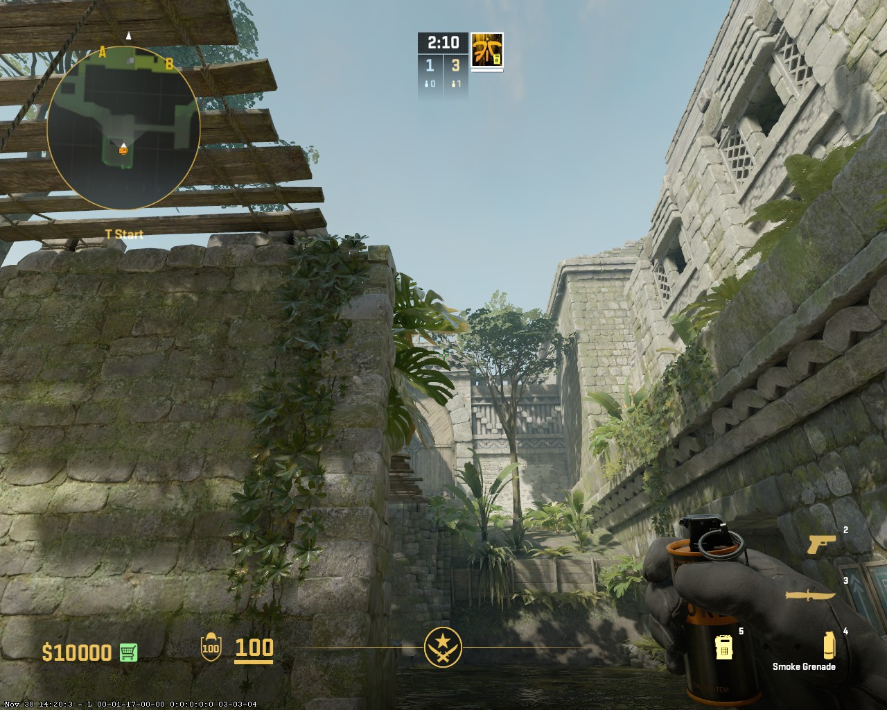
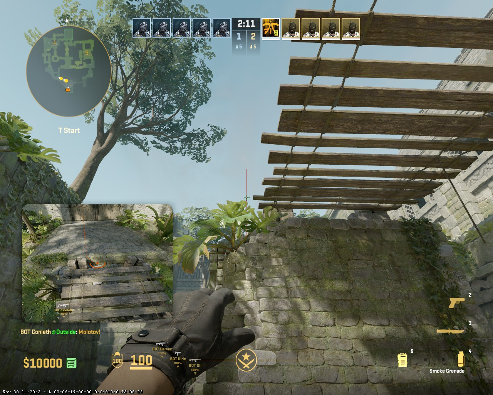
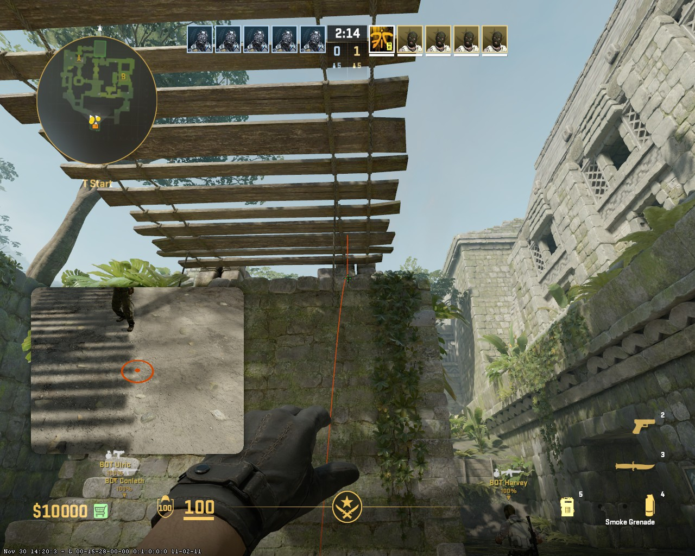
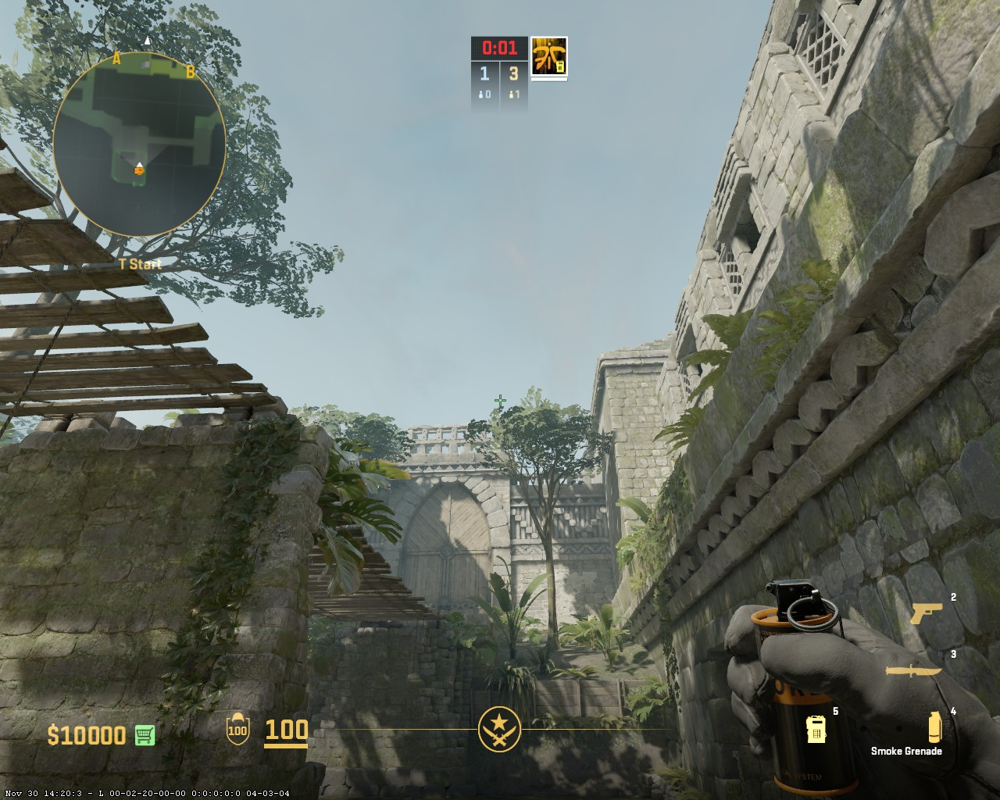

< [Main](./README.md)
< [Ancient](../../README.md)

# Insta window from T base

### 1 spot - Run Jump Throw

### 2 spot - Run Jump Throw

### 3 spot - Run Jump Throw

### 4 spot - Run Jump Throw

### 5 spot - Run Jump Throw

