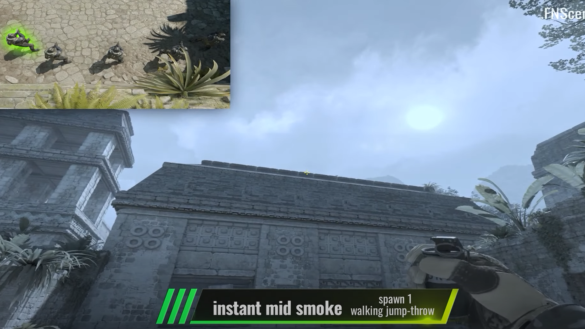
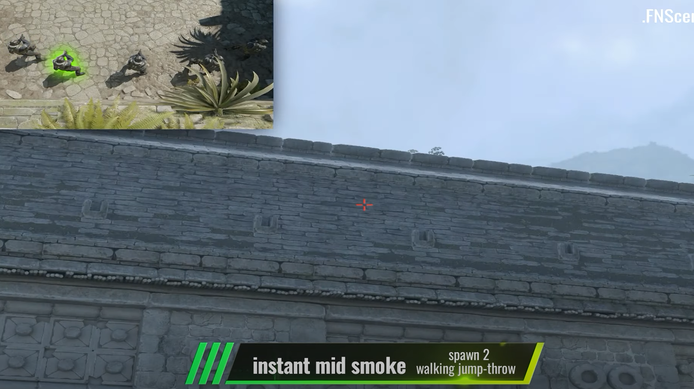
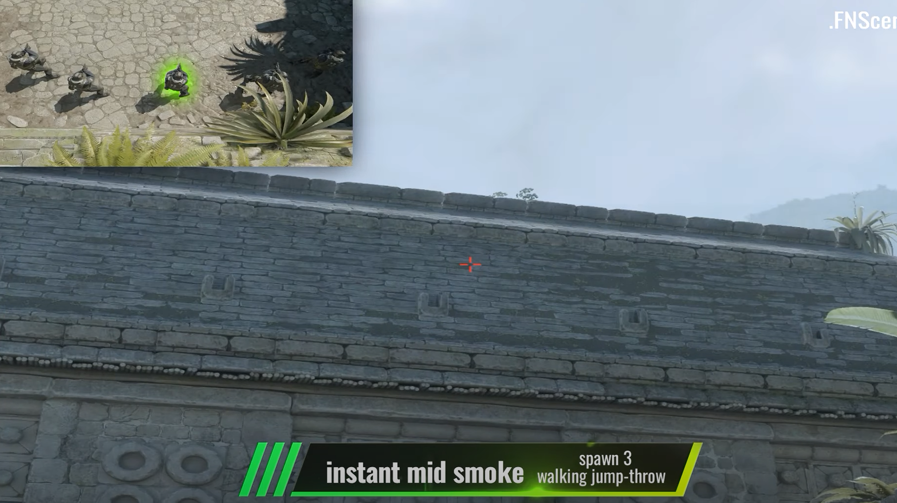
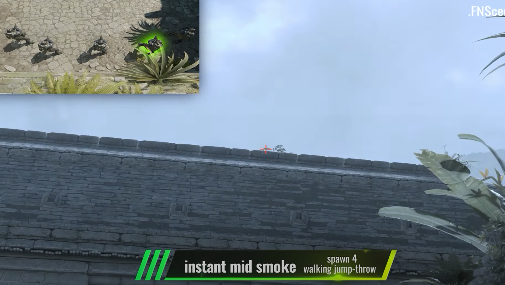
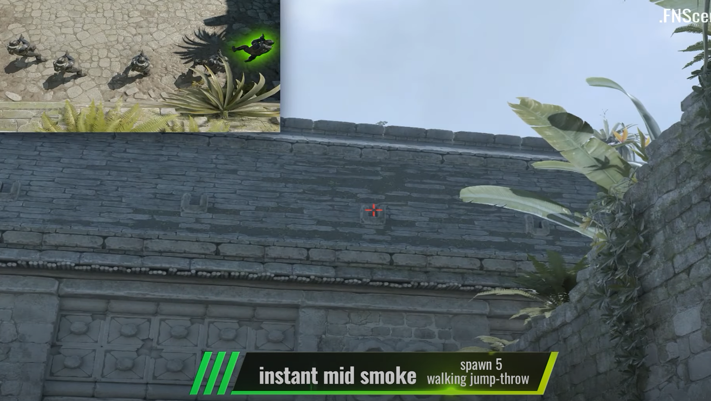
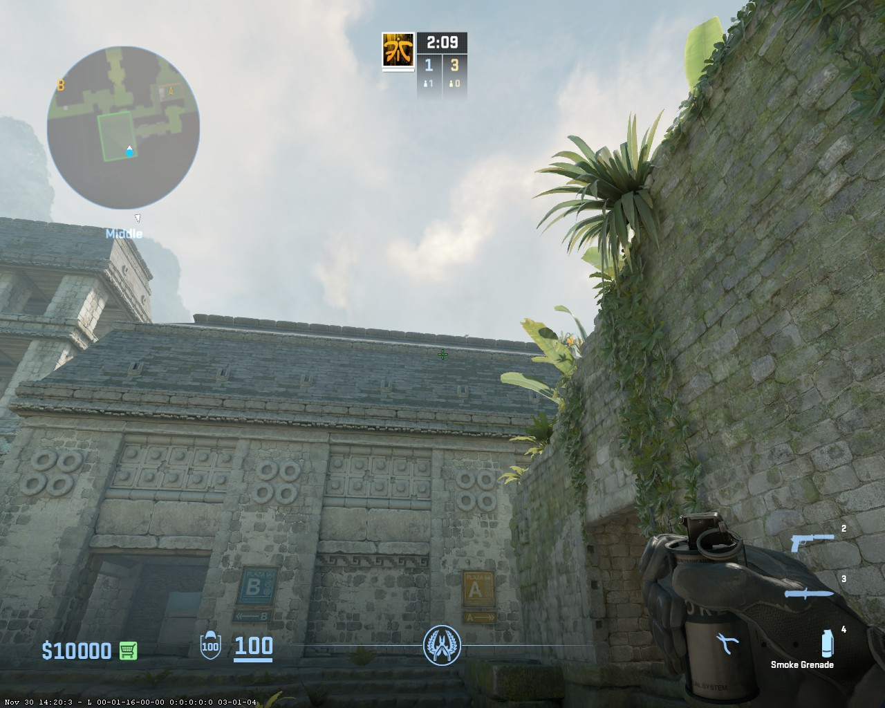
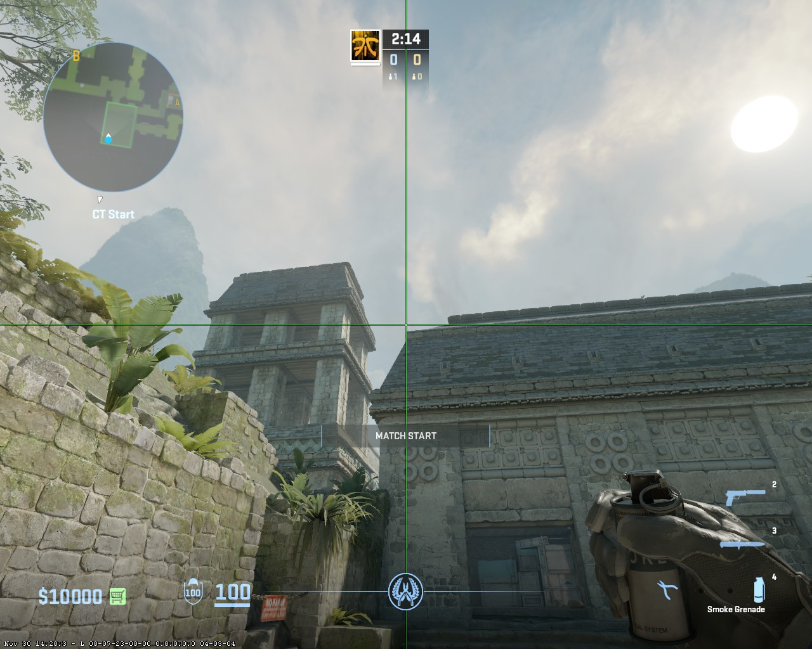

[main menu](./README.md)
___

# Ancient

## Insta mid from CT base

### 1 spot - 2 shift steps + Jump Throw

### 2 spot - 2 shift steps + Jump Throw

### 3 spot - 2 shift steps + Jump Throw

### 4 spot - 2 shift steps + Jump Throw

### 5 spot - 2 shift steps + Jump Throw

## Insta cave from 1 spot CT base

